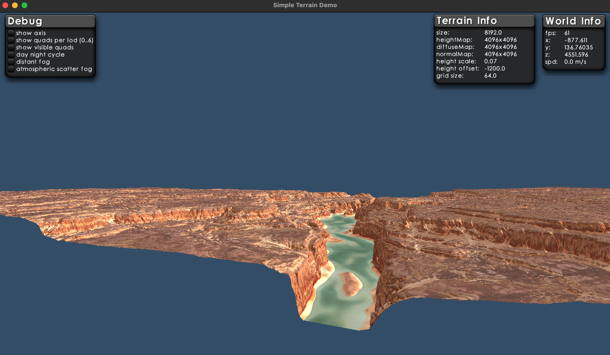
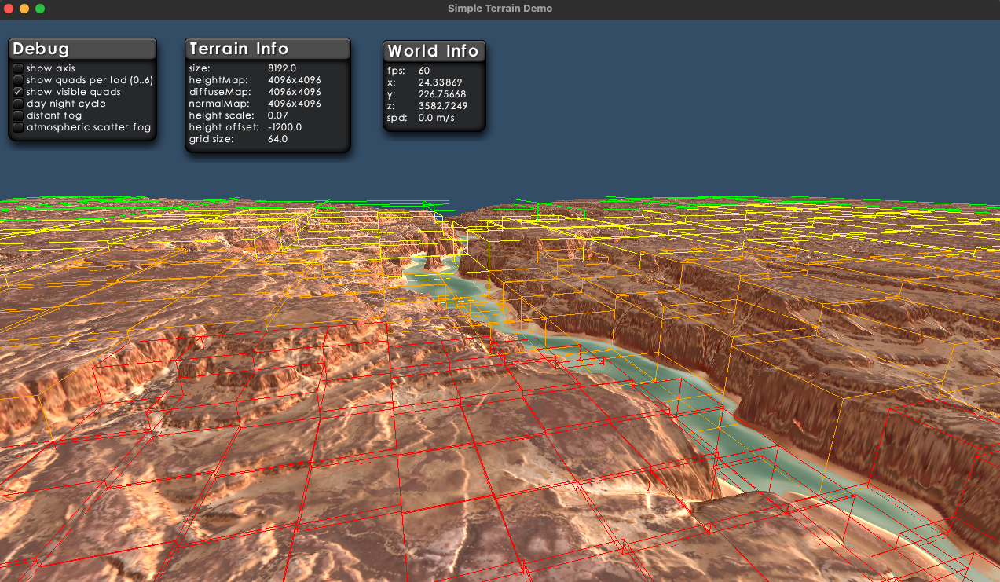
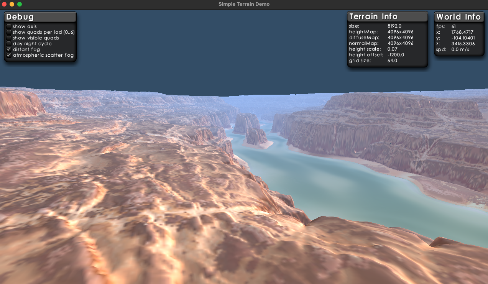

<!-- TOC -->
* [CDLOD Terrain Surface Rendering for LibGDX.](#cdlod-terrain-surface-rendering-for-libgdx)
  * [How to Use](#how-to-use)
  * [CDLOD Terrain – Technical Summary](#cdlod-terrain--technical-summary)
    * [Key Concepts](#key-concepts)
      * [Quadtree‑based LOD selection](#quadtreebased-lod-selection-)
      * [Regular grid meshes](#regular-grid-meshes-)
      * [Continuous morphing](#continuous-morphing)
      * [Crack‑free stitching](#crackfree-stitching-)
      * [Height sampling on the GPU](#height-sampling-on-the-gpu-)
      * [View‑dependent refinement](#viewdependent-refinement)
  * [Why CDLOD?](#why-cdlod)
  * [Typical Pipeline](#typical-pipeline)
  * [Upcoming Work](#upcoming-work)
  * [Future Enhancements (Planned)](#future-enhancements-planned)
  * [Lesson learns](#lesson-learns)
  * [Preparing heightmaps](#preparing-heightmaps)
    * [Making the heightmap linear (just in case)](#making-the-heightmap-linear-just-in-case)
    * [Packing height into the RG channels](#packing-height-into-the-rg-channels)
<!-- TOC -->

# CDLOD Terrain Surface Rendering for LibGDX.
This terrain system is inspired by [Filip Strugar's CDLOD paper](https://github.com/fstrugar/CDLOD/tree/master) from 2010.
- The amazing terrain height, diffuse, and normal textures are sourced from [MotionForgePictures](https://www.motionforgepictures.com/height-maps/).
- The illustrations come from the companion project, [libgdx-cdlod-demo](https://github.com/istvandudas/libgdx-cdlod-demo) 
project.
  - It’s a great place to start if you want to dive in and try things out.

I also noticed that there are very few easy‑to‑use, shader‑based terrain solutions available for Java game development,
so this project aims to fill that gap.

## How to Use
- This is a standard Java library. It was developed using Java 21 and Gradle 9, but it does not rely on any 
Java 21‑specific features. If you intend to use an earlier Java version, you may need to downgrade Gradle accordingly.
- The library is not yet available through a public Maven repository.
- Since it is a regular Java library, you can integrate it into your project however you prefer. The recommended 
approach is to clone the project, build it, and publish it to your local Maven repository. After that, you can reference
it as a normal dependency. (Don’t forget to add _mavenLocal()_ to the _repositories_ section of your build.gradle.)
- You may also want to explore the companion repository, libgdx-cdlod-demo, for practical usage examples.
- The terrain material currently supports addons (modifiers), though this system may be restructured in the future.
  - A basic Day/Night Cycle addon is already included.

## CDLOD Terrain – Technical Summary
CDLOD (Continuous Distance‑Dependent Level of Detail) is a GPU‑friendly terrain rendering technique designed for large, heightmap‑based worlds. It provides smooth, continuous LOD transitions without cracks, popping, or heavy CPU overhead. Unlike traditional chunked LOD systems, CDLOD uses a quadtree of regular grids and a morphing scheme that ensures stable geometry across LOD boundaries.

The heightmap is 


### Key Concepts
#### Quadtree‑based LOD selection  
The terrain is divided into a hierarchical quadtree. Each node represents a square region of the heightmap at a specific resolution. During rendering, the system selects only the nodes whose screen‑space error is acceptable, producing an adaptive set of patches.

#### Regular grid meshes  
All terrain patches use the same fixed‑resolution grid mesh (e.g., 32×32). This allows:
- zero per‑patch mesh generation
- excellent GPU cache behavior
- predictable vertex/index buffers
- minimal CPU work per frame

#### Continuous morphing
CDLOD blends between LOD levels using a morph factor computed from camera distance. This eliminates visible “popping” when switching between resolutions.


#### Crack‑free stitching  
Neighboring patches at different LOD levels are stitched automatically using:
- index‑based skirts, 
- or vertex morphing along borders
- ensuring seamless transitions without gaps.

#### Height sampling on the GPU  
Vertex shaders sample the heightmap (or a clipmap/texture array) directly, allowing:
- dynamic height updates
- very large terrains
- minimal CPU‑side memory usage

#### View‑dependent refinement
Only patches visible in the camera frustum are evaluated. Combined with the quadtree, this keeps draw calls extremely low even for massive worlds.

## Why CDLOD?
- Scales to huge terrains (tens or hundreds of kilometers)
- Low CPU cost — most work is done on the GPU
- No popping thanks to continuous morphing
- Simple, predictable geometry (one reusable grid mesh)
- Efficient culling and LOD selection 
- Easy to integrate with physics, raycasts, and gameplay



## Typical Pipeline
- Prepare heightmap texture, it should be:
  - RGBA8888, 16bit height, rg encoded. 
- Build a quadtree from the heightmap.
- Each frame:
  - Perform frustum culling.
  - Select visible nodes based on screen‑space error.
  - Compute morph ranges for each node.
- Render selected nodes using a shared grid mesh.
- Vertex shader samples heightmap and applies morphing.

## Upcoming Work
- Add support for general world‑offset handling
- Prepare and publish the library to a public Maven repository (Maven Central or an alternative)
## Future Enhancements (Planned)
- Additional terrain material addons (weather effects, biome blending, etc.)
- Improved tooling for heightmap preparation and validation

## Lesson learns
- 8‑bit heightmaps usually don’t provide enough detail
- Creating a 16‑bit linear RG‑encoded heightmap can be surprisingly tricky:

## Preparing heightmaps
### Making the heightmap linear (just in case)
Some tools export heightmaps with embedded color profiles or gamma curves, which can distort height sampling in shaders. To ensure the image is truly linear (no gamma correction), you can force‑strip metadata and apply a neutral gamma:
```bash
magick "x.png" -strip -gamma 1.0 cleaned.png
```
### Packing height into the RG channels
CDLOD works best with 16‑bit height precision, but many pipelines only support 8‑bit per channel textures.
A common solution is to pack the height value into two channels:
- R → high byte
- G → low byte

This gives you a full 16‑bit range while still using a standard 8‑bit RG texture.
In the shader, you reconstruct the height like this:

```glsl
float height = r * 65536.0 + g * 256.0;
```
This approach avoids banding, preserves fine terrain detail, and works reliably across all LibGDX backends.

Here is a small python code, (just in case):
```python
from PIL import Image
import numpy as np

# Load 16-bit grayscale PNG
img = Image.open("cleaned.png")
arr = np.array(img, dtype=np.uint16)

# Split into high and low bytes
high = (arr >> 8).astype(np.uint8)
low  = (arr & 0xFF).astype(np.uint8)

# Create RGBA image
rgba = np.zeros((arr.shape[0], arr.shape[1], 4), dtype=np.uint8)
rgba[..., 0] = high
rgba[..., 1] = low
rgba[..., 2] = 0
rgba[..., 3] = 255

# Save as RGBA PNG
out = Image.fromarray(rgba, mode="RGBA")
out.save("height_rg.png")
```
